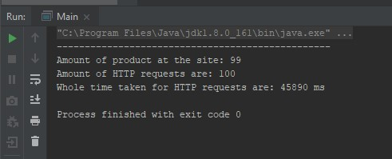
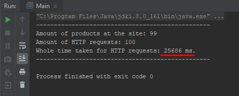

# WEB SHOP PARSER

# Table of Contents
* [Project purpose](#purpose)
* [Project structure](#structure)
* [Start](#user-start)
* [License](#license)
* [Authors](#authors)

# Project purpose
Web shop parser is the app for grabbing information about products from web shop.

This parser is the app for site https://www.aboutyou.de/maenner/bekleidung. 
It helps to gather information about:

* product name
* brand
* color
* price
* article ID

of all products from this shop.

This app can be used in multithreading environment.
The difference in execution with one thread:

And with 4 threads:

# Project Structure
* Java 8
* Maven 4.0.0
* Jackson 2.9.8
* Jsoup 1.8.3
* Log4j 2.11.1
* Lombock 1.18.4

# Start
You can load project from GitHub, to your development environment.
Execute *mvn clean install* command and have a *jar* file.

You can run it by: java -jar parser.jar in terminal. 
And you will have a JSON file in a root directory of your project.

# License

***Copyright (c) 2019 Mate Academy (NOV18)***

Permission is hereby granted, free of charge, to any person obtaining a copy of this software and associated documentation files (the "Software"), to deal in the Software without restriction, including without limitation the rights to use, copy, modify, merge, publish, distribute, sublicense, and/or sell copies of the Software, and to permit persons to whom the Software is furnished to do so, subject to the following conditions:

The above copyright notice and this permission notice shall be included in all copies or substantial portions of the Software.

THE SOFTWARE IS PROVIDED "AS IS", WITHOUT WARRANTY OF ANY KIND, EXPRESS OR IMPLIED, INCLUDING BUT NOT LIMITED TO THE WARRANTIES OF MERCHANTABILITY, FITNESS FOR A PARTICULAR PURPOSE AND NONINFRINGEMENT. IN NO EVENT SHALL THE AUTHORS OR COPYRIGHT HOLDERS BE LIABLE FOR ANY CLAIM, DAMAGES OR OTHER LIABILITY, WHETHER IN AN ACTION OF CONTRACT, TORT OR OTHERWISE, ARISING FROM, OUT OF OR IN CONNECTION WITH THE SOFTWARE OR THE USE OR OTHER DEALINGS IN THE SOFTWARE.

# Authors
* https://github.com/YatKat
